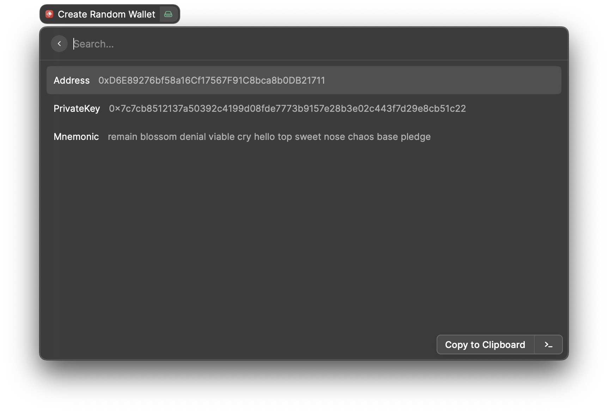
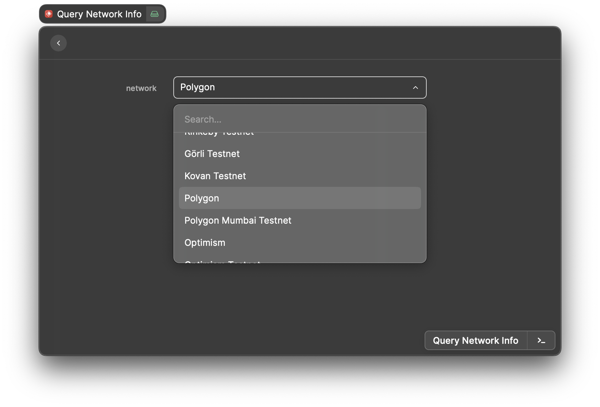
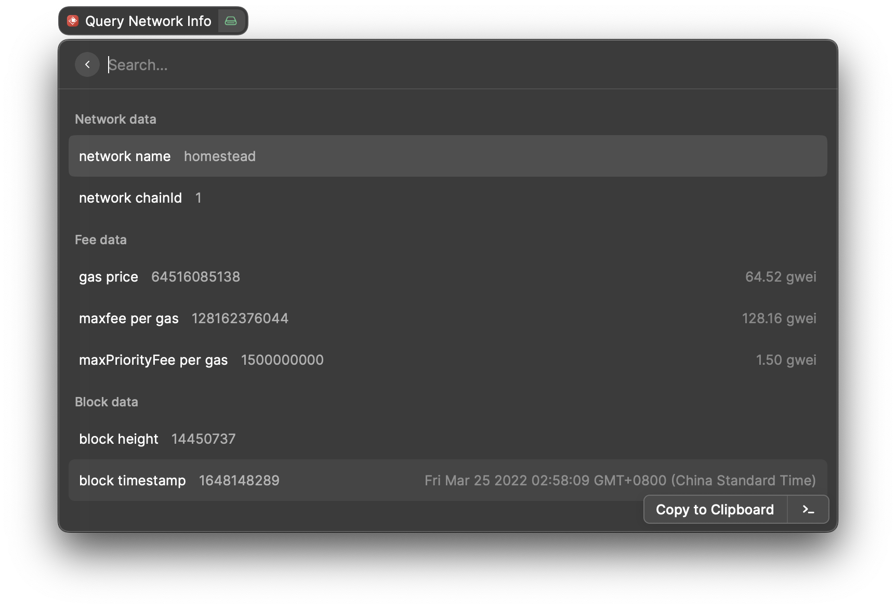

## Raycast-ether (WIP)

A Raycast extension that provides utilities for Ethereum development.

## Commands
### Create Random Wallet

Create a random wallet, display its address, private key, and mnemonic phrase. This wallet can be used as a throwable wallet in development.

### Query Network Info

Get the current info of a network such as gasprice and block height.

## How to use

+ Clone or download to a local directory
+ In Raycast, search  `Import Extension` command
+ Choose the local repo directory